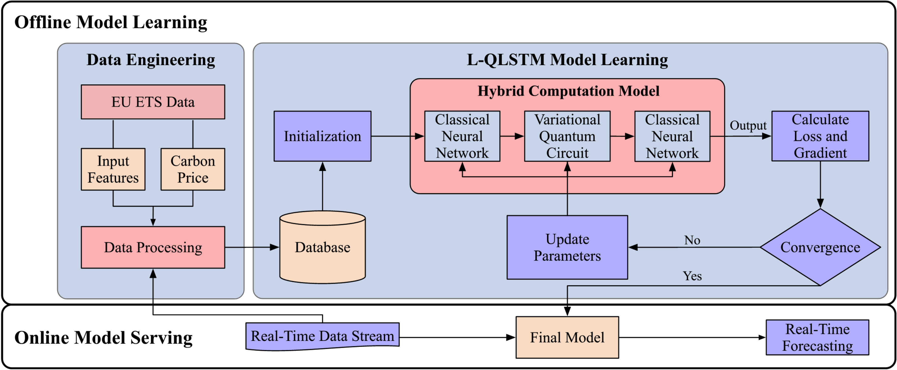

# qlstm — Quantum LSTM layers for PyTorch

<p align="center">
  <a href="https://pypi.org/project/qlstm/"></a>
  <a href="https://github.com/TravisCao/Quantum-LSTM/actions/workflows/ci.yml"></a>
  <a href="https://pypi.org/project/qlstm/"></a>
  <a href="LICENSE"></a>
  <a href="https://doi.org/10.1007/s42484-023-00115-2"></a>
</p>

`qlstm` is a small PyTorch library that provides a quantum long short-term memory
(LSTM) layer with the same call signature as `torch.nn.LSTM`. Each of the four
LSTM gates is a variational quantum circuit, so you can drop a quantum recurrent
layer into an existing model by changing one line. It packages the model from
[Cao et al., *Linear-layer-enhanced quantum long short-term memory for carbon
price forecasting*, Quantum Machine Intelligence (2023)](https://doi.org/10.1007/s42484-023-00115-2)
as a reusable, tested component.

<p align="center">
  
</p>

## Install

```bash
pip install qlstm
```

This pulls in PyTorch and [PennyLane](https://pennylane.ai/). Python 3.10 or
newer is required.

## Quickstart

```python
import torch
from qlstm import LQLSTM

# Same interface as torch.nn.LSTM (single layer, one direction).
layer = LQLSTM(input_size=8, hidden_size=4, n_qubits=4)

x = torch.randn(6, 2, 8)              # (seq_len, batch, input_size)
output, (h_n, c_n) = layer(x)
print(output.shape)                  # torch.Size([6, 2, 4])
print(h_n.shape)                     # torch.Size([1, 2, 4])
```

A complete training loop on a small synthetic task is in
[`examples/quickstart.py`](examples/quickstart.py). A fair side-by-side against a
classical `torch.nn.LSTM` on the same task is in
[`examples/benchmark_vs_classical.py`](examples/benchmark_vs_classical.py).

## Two models: `QLSTM` and `LQLSTM`

The gates are variational quantum circuits that act on `n_qubits` wires. The
difference is how the data reaches those wires.

- **`LQLSTM`** (linear-enhanced, the paper’s model, recommended). A classical
  linear layer projects `[x_t, h_{t-1}]` down to `n_qubits`, the circuit
  processes it, and a second linear layer projects the measurements up to
  `hidden_size`. Input and hidden sizes are therefore free to choose.
- **`QLSTM`** with `linear_enhanced=False` (classic quantum LSTM). The circuit
  acts directly on `[x_t, h_{t-1}]`, which requires
  `n_qubits == input_size + hidden_size`.

`QLSTM` defaults to `linear_enhanced=True`, so `QLSTM(...)` and `LQLSTM(...)`
build the same model; use `LQLSTM` when you want the name to be explicit.

```python
from qlstm import QLSTM

# Classic variant: circuit acts on the raw concatenation, so the dimensions
# must line up (4 + 3 == 7).
layer = QLSTM(input_size=4, hidden_size=3, n_qubits=7, linear_enhanced=False)
```

## Stacking layers

Set `num_layers` to stack recurrent layers, exactly as in `torch.nn.LSTM`. Each
layer reads the hidden-state sequence of the layer below. `output` is the top
layer's sequence, and `h_n`/`c_n` gather the final state of every layer with
shape `(num_layers, batch, hidden_size)`. A non-zero `dropout` applies dropout to
the output of each layer except the last.

```python
import torch
from qlstm import LQLSTM

layer = LQLSTM(input_size=8, hidden_size=4, n_qubits=4, num_layers=2, dropout=0.1)

x = torch.randn(6, 2, 8)
output, (h_n, c_n) = layer(x)
print(output.shape)                  # torch.Size([6, 2, 4])
print(h_n.shape)                     # torch.Size([2, 2, 4])
```

## API

| Object | Purpose |
| --- | --- |
| `QLSTM` | Sequence layer with a `torch.nn.LSTM`-style interface. |
| `LQLSTM` | `QLSTM` fixed to the linear-enhanced model. |
| `QLSTMCell` | One recurrent step, for custom loops. |
| `make_vqc` | Build the underlying variational circuit as a `torch` layer. |

Key constructor arguments (shared by `QLSTM`, `LQLSTM`, and `QLSTMCell`, except
`num_layers` and `dropout`, which apply to the sequence layers only):

| Argument | Default | Meaning |
| --- | --- | --- |
| `n_qubits` | `4` | Wires per gate circuit. |
| `n_qlayers` | `1` | Depth of the entangling ansatz. |
| `num_layers` | `1` | Number of stacked recurrent layers (`QLSTM`/`LQLSTM`). |
| `dropout` | `0.0` | Dropout on the output of each layer except the last (`QLSTM`/`LQLSTM`). |
| `ansatz` | `"basic"` | `"basic"` ([`BasicEntanglerLayers`](https://docs.pennylane.ai/en/stable/code/api/pennylane.BasicEntanglerLayers.html)) or `"strong"` ([`StronglyEntanglingLayers`](https://docs.pennylane.ai/en/stable/code/api/pennylane.StronglyEntanglingLayers.html), more expressive). |
| `rotation` | `"Y"` | Angle-embedding axis (`"X"`, `"Y"`, or `"Z"`). |
| `input_activation` | `"arctan"` | Angle activation before embedding; bounds the encoded angles as in the paper. `"tanh"`, `None`, or any callable also work. |
| `backend` | `"default.qubit"` | Any PennyLane device, e.g. `"lightning.qubit"`. |
| `diff_method` | `"backprop"` | Differentiation method; `lightning.qubit` switches to `"adjoint"` automatically. |
| `batch_first` | `False` | Use `(batch, seq, feature)` instead of `(seq, batch, feature)`. |

## How it works

A classical LSTM computes each gate as an affine map followed by a sigmoid or
tanh. `qlstm` replaces the affine map with an encode-entangle-measure quantum
block: the input is angle-embedded on `n_qubits` wires, an entangling ansatz with
trainable weights is applied, and `⟨Z⟩` is measured on every wire. On the
`default.qubit` simulator the circuit is differentiated by backpropagation, so
gradients reach both the circuit weights and the layer inputs, and
backpropagation through time works across the recurrent steps.

## Reproduce the paper

The original experiment — carbon price forecasting on European Union carbon
market data — is preserved under [`src/`](src/) with its dataset in
[`data/`](data/). It trains the quantum and classical baselines through
[PyTorch Lightning](https://lightning.ai/) and logs to
[Weights & Biases](https://wandb.ai/).

```bash
pip install -r requirement.txt          # pinned versions for the paper code

python src/train.py --batch_size 16 --model_name xx-QLSTM --accelerator cpu --n_qubits 4
python src/train.py --batch_size 16 --model_name QLSTM   --accelerator cpu --n_qubits 4
python src/run_lstm.py --seed 1 --data period2 --hidden_dim 3
```

The `src/` code targets the pinned dependencies in `requirement.txt`; the
installable `qlstm` package targets current PyTorch and PennyLane.

<details>
<summary>Dataset details</summary>

The dataset covers the European Union carbon market from 2014-01-01 to
2020-12-31.

Column names:

- `Price`: carbon price
- `High`: highest price
- `Low`: lowest price
- `Open`: opening price
- `Vol`: trading volume
- `Week`: week number of the year
- `Year`: year of the day
- `t`: remaining days to the last open day of the year

CSV files:

- `x_3d.csv`: features of the last day, the day before, and the same weekday last week.
- `x_5d.csv`: features of the last five days.

Periods:

- `period1`: 2014-01-01 to 2016-12-31.
- `period2`: 2017-01-01 to 2020-12-31.

</details>

## Citation

If you use this software, please cite the paper:

```bibtex
@article{cao2023linear,
  title={Linear-layer-enhanced quantum long short-term memory for carbon price forecasting},
  author={Cao, Yuji and Zhou, Xiyuan and Fei, Xiang and Zhao, Huan and Liu, Wenxuan and Zhao, Junhua},
  journal={Quantum Machine Intelligence},
  volume={5},
  number={2},
  pages={26},
  year={2023},
  publisher={Springer}
}
```

GitHub’s “Cite this repository” button reads the machine-readable
[`CITATION.cff`](CITATION.cff).

## Questions

Open an [issue](https://github.com/TravisCao/Quantum-LSTM/issues) or contact
travisyjcao@gmail.com.

## License

[MIT](LICENSE).
